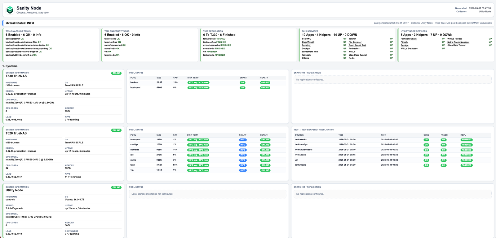

# Sanity Node

> Observe. Announce. Stay sane.

Sanity Node is a lightweight homelab dashboard that observes systems, services, storage, snapshots, backups, replications, and update states from one small Linux / Utility collector node.

It was originally built for my own homelab, where a Utility Node watches TrueNAS systems, Docker services, helper containers, ZFS pools, snapshot tasks, replication jobs, local storage, and backup status.

The goal is simple:

**Open one page and know whether the homelab is still doing what it should be doing.**

Because in a homelab, everything works perfectly until it does not.

---

## Screenshot



---

## Current project status

Sanity Node is currently moving from a personal, homelab-tested reference implementation toward a public, configuration-driven project.

The current repository contains the working reference version that has been tested in my own environment. Some logic is still hardcoded for that setup.

The public direction is now defined:

- one Linux / Utility collector node
- one or more configured hosts
- optional TrueNAS SCALE monitoring
- optional local, Docker, HTTP, backup, replication, and update checks
- a self-documenting `config.yaml`
- a future Docker Compose install flow on port `8099`
- host-based public summary preview cards generated from configured hosts
- a later four-card public summary model:
  - Systems
  - Storage
  - Protection
  - Services / Updates

In other words:

> It works.
> It is useful.
> It is becoming more reusable.
> No fake perfection.

---

## What Sanity Node monitors

Sanity Node can display and summarize:

- Linux / TrueNAS system information
- host online/offline state
- hostname, OS, kernel, uptime, CPU, memory, and load
- TrueNAS pool health
- pool capacity
- disk temperature summaries
- SMART status
- snapshot task freshness
- replication state
- backup status
- running apps
- helper services
- HTTP-checked services
- local storage on the collector node
- Docker container status
- image update state, for example through Diun

The dashboard separates services into simple categories:

### Apps

User-facing services you actually open and use, such as:

- Jellyfin
- Wiki.js
- SearXNG
- OpenWebUI
- File Browser
- Scrutiny
- Dockge
- Pi-hole
- NGINX Proxy Manager

### Helpers

Backend or infrastructure services that keep things alive in the background, such as:

- Cloudflare Tunnel
- Redis
- Ollama
- databases
- Tailscale
- Diun

This makes the dashboard easier to read than a plain container count.

Instead of:

```text
14 containers running
```

Sanity Node can show:

```text
14 Services · 13 UP · 1 UPDATE · 0 DOWN
```

Much better. Less guessing. More sanity.

---

## Why this exists

The problem was not that my homelab had no information.

The problem was that the information was everywhere.

To check everything manually, I had to open TrueNAS, Docker, Dockge, service web UIs, snapshot pages, replication pages, SSH sessions, logs, and possibly a small emotional support terminal.

Sanity Node gives me one clean overview.

It does not replace TrueNAS, Grafana, Uptime Kuma, Scrutiny, Netdata, or any other proper monitoring tool.

It is my sanity check layer.

One page.
One view.
One quick answer:

**Is everything still OK?**

---

## Documentation

The project/concept page explains what Sanity Node is, why it exists, what it monitors, and how the dashboard concept evolved:

[Project Sanity Node](https://wiki.homelabvonh23rz.me/en/Project_Sanity_Node)

The installation tutorial explains the public install direction, requirements, collector-node concept, TrueNAS SSH requirement, Docker Compose layout, `config.yaml`, and the start-small approach:

[Installing Sanity Node](https://wiki.homelabvonh23rz.me/en/Install_Sanity_Node)

The current GitHub repository is still being aligned with that public install direction. Until the Docker/Compose/config-driven version is implemented, treat the installation tutorial as the target architecture for the next public phase.

---

## Repository structure

```text
sanity-node/
├── README.md
├── LICENSE
├── docs/
│   └── assets/
│       └── sanity-node-dashboard-readme.png
├── examples/
│   └── config.example.yaml
├── scripts/
│   └── generate-dashboard.py
├── systemd/
│   ├── sanity-node-generate.service
│   ├── sanity-node-generate.timer
│   └── sanity-node-web.service
└── web/
    └── favicon and web manifest assets
```

---

## Current reference implementation

The current reference implementation uses:

- Python 3
- systemd
- a static generated HTML dashboard
- SSH access from the Utility Node to TrueNAS systems
- TrueNAS SCALE middleware calls through `midclt`
- local Docker checks where available
- HTTP checks for selected services

Some values are still hardcoded in:

```text
scripts/generate-dashboard.py
```

This includes personal hostnames, IP addresses, services, pool relationships, local paths, and backup targets.

That is intentional for the current reference version. The next major development goal is to move those definitions into `config.yaml`.

---

## Configuration direction

The future public configuration model is represented in:

```text
examples/config.example.yaml
```

That file is intentionally self-documenting. It uses:

```text
🟧 Required = review or change this for your environment
🩵 Optional = enable only if you use this feature
```

The goal is that users should be able to describe their own homelab without editing the Python code.

Current Phase 2 public-preview behavior:

- configured hosts can appear as host-based summary cards
- host Web UI links can show preview reachability badges
- configured HTTP services can report live `UP` / `DOWN`
- configured Docker services on the collector node can report live container status
- configured TrueNAS app services can report live app status for enabled `type: truenas` hosts
- configured local storage checks can report collector-local filesystem usage using `df`
- configured backup checks can report collector-local marker-file freshness and optional systemd timer state
- Docker checks for other hosts, TrueNAS app checks on non-TrueNAS hosts, local storage checks for non-collector hosts, and backup checks for non-collector hosts are shown as `NOT CHECKED` for now
- the original hardcoded five-card reference summary remains untouched while this preview path is developed

The future model separates:

```text
docker-compose.yml = how Sanity Node runs
config.yaml        = what Sanity Node monitors
.env               = optional local overrides
ssh/               = optional SSH keys for remote checks
html/              = generated dashboard output
logs/              = runtime logs
```

---

## Public install direction

The planned public install flow is:

```text
git clone
copy config.example.yaml to config.yaml
edit dashboard, collector, and host settings
add SSH keys if TrueNAS monitoring is enabled
start Sanity Node with Docker Compose
open http://collector-ip:8099
enable optional features later
```

Sanity Node should start small and grow with the environment.

A first useful setup can be as simple as:

```text
dashboard
collector
one host
one or two basic modules
```

Optional features can be enabled later:

```text
services
local storage
backup checks
snapshot checks
replication checks
image update monitoring
```

---
## Future plans

Planned improvements:

- configuration-driven hosts
- configuration-driven services
- configuration-driven local storage checks
- configuration-driven backup checks
- configuration-driven protection relationships
- Docker Compose runtime
- `.env.example`
- Dockerfile
- safer first-run checks
- public-preview layout moving from host-based cards toward four global summary cards
- cleaner separation between personal deployment and public template

---

## Philosophy

Sanity Node should stay simple.

It should observe what matters, announce clearly, and avoid becoming a monitoring monster.

Sanity Node is custom-built, open-source-minded, and hands-on by design.

It grew from learning, testing, breaking things, fixing them again, and turning those lessons into a dashboard that announces whether the homelab is still behaving as expected.

The purpose is not to collect every metric possible.

The purpose is to answer:

```text
Is my homelab still sane?
```

And if the answer is no, it should point me in the right direction before I waste half an evening blaming DNS again.

Although, to be fair, it probably was DNS.
